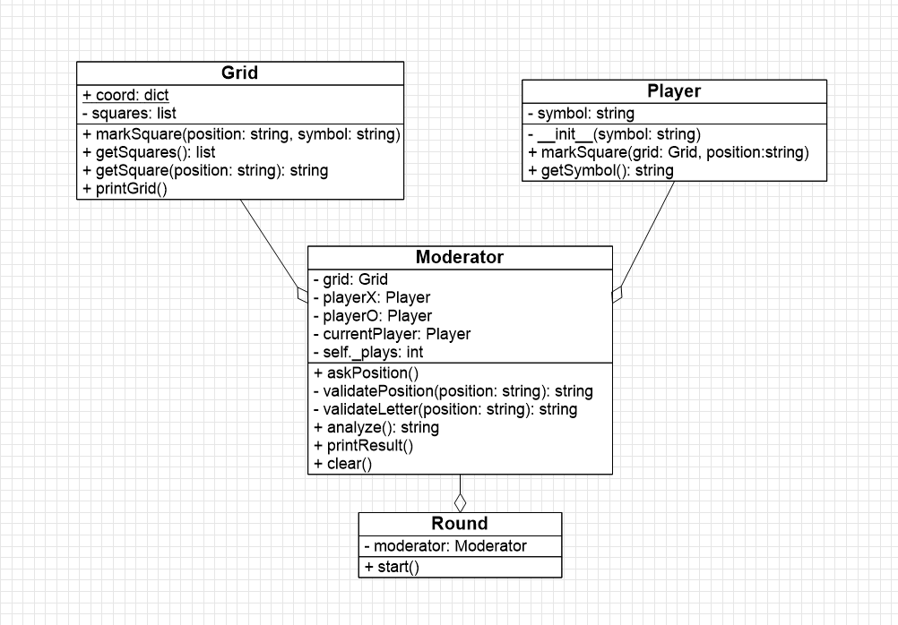

<div align = "center">

# Tic-Tac-Toe Game


It's a popular game "for two player  who take turns marking the spaces 
in a three-by-three grid with **X** or **O**. The player who succeeds in placing 
three of their marks in a horizontal, vertical, or diagonal row is the winner."

</div>

## Requirements
  Python 3.x

## How to Use?

1. Clone the repository:
    ```bash
    git clone https://github.com/adelino-dev/jogo-da-forca.git
    ```

2. Run the file "main.py"

## UML Class DIagram


